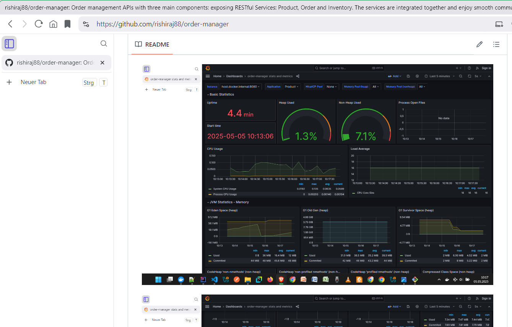
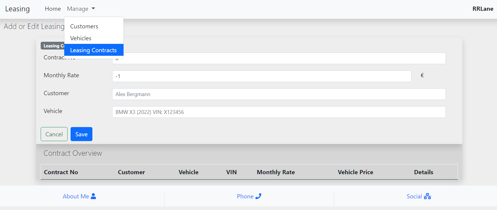
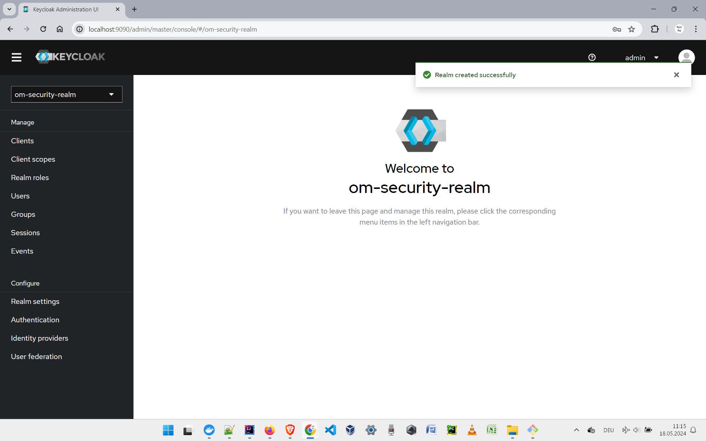

# Hi 👋, dear reader!

Feel free to fork into the respositories here. The nice acts of collaboration and sharing are always welcome.  

To prioritise realisable ideas (SMART goals) and realise the top three, I rate them with-
- feasibility study,
- absolute value proposition,
- cost in terms of effort and time, and 
- value for money (the returns against risk & investment). RoRI = RoR + RoI

## 🔭 By now I have mainly developed [HCM function of Employee onboarding and training induction under ERP](https://github.com/rishiraj88/EmployeeOnboardingStateMachine/tree/main), [Vehicle Leasing Contract](https://github.com/rishiraj88/leasing) and [e-Commerce Order Manager](https://github.com/rishiraj88/order-manager). One-liners about these projects
- Employee Onboarding demonstrates the coherent sequencing of various tasks, which are performed while welcoming a new person on board (after the acceptance of job offer). These tasks include selection and assignment of and training workflows as well as updating the personal details of the persons in Human Capital Management (HCM) module of a modern ERP system.
- `Vehicle Leasing Contract` is a Self-Help Portal for the customers to take vehicles on lease, to abide by in-force lease-contract policies and to return the vehicles to dealers. The portal is for use only by end-customers. 
- On the other hand, `Order Manager` demonstrates the technological collaboration of Kubernetes clustering with Kafka Message Queuing. On functional side, it is an implementation of the core functionalities of Order module of any modern e-commerce or marketplace platform. It encompasses the synchronous communication between Order and Inventory to check in-stock status of items, and asynchronous communication between Order and Notification (flexible for Email, Push and more modes). Product details are fetched from Product module.
- In common, these applications have been developed using RESTful APIs and Microservice architecture, ready to containerize and deploy in cloud and data centers.

## New Capabilities and PoC's
- Implementation of Message Queues with Kafka being the message broker.
- Orchestration of Microservices in Docker containers using Kubernetes (with YML-powered declarations.
- One more parallel attempt is to add a few apps built with Kotlin.

- I am making deliberate use of the beneficial features of Java 17 and higher versions, such as Record type, switch expression, HttpClient along with the very popular Stream API, Date/Time API and Optional. And, yes, the superpowers of the already tremendous Java 8 facilities have been further bolstered in the later releases of the language (canonically known as JLS: the Java Language Specification).

## 🌱 Alongside I’m fostering myself with more of: "all things containers" and orchestration, such as
- Docker networking across OSI Model layers of networks,
- hosting the containers in cloud infrastructure as well as in virtual networks,
- orchestrating clusters using Kubernetes, local registries and IaC tools, and
- Apache NiFi for data flow and application testing.

## 🤔 I have always been curious about Green Development by enhancing system performance. To me, the easiest approach to achieve Sustainability is:
- to write highly performant applications, services and platforms.
- In case I fall short of the SME level of expertise regarding some tools, I rely on the promises of the respective providers. They include the leading cloud service providers.

## 📫 Feel free to Reach Me for Feedback, Queries, Collaboration and More:
- _LinkedIn Profile:_ https://www.linkedin.com/in/rishirajopenminds
- _Contact Card:_ https://bio.link/rishiraj49de
- _X:_ https://twitter.com/RishiRajDevOps
- _My Work:_ https://github.com/rishiraj88?tab=repositories

### This README is updated above this line [on 2025-02-14]. The review of the below lines will follow. ###

## 💬 My Best among Key Skills: 
### Driving Factors: Innovations, Partnerships, Initiatives 
- Product Architectures: Event-driven, ReSTful APIs, Microservice Architecture, Messaging
- Development & Design: REST Principles, TDD, Continuous Delivery, DevOps, Domain-Driven Design, SOLID, YAGNI, Requirements Engineering (FR+NFR), Agile, Documentation, JIRA, Integration Testing, E2E Testing
- Languages: Java, Jakarta EE, Multithreading, Kotlin, JavaScript, Bash
- Frameworks & Environments: Spring Boot, Node.js, Express.js, TypeScript, Hibernate, Spring Security, Spring Cloud, React.js, Angular, Thymeleaf
- Utilities: Kafka, Message Queue, JUnit, UML, Mockito, Webpack, Babel, Jest, Git, BitBucket (Atlassian), Sentry, IntelliJ IDEA, VS Code, eclipse
- Data Stores: RDBMS (MySQL, Oracle, PL/SQL), NoSQL (MongoDB, Redis)
- Platforms: AWS (EC2, S3, Lambda, Step Functions, RDS, ECR, ECS, Fargate), GCP (Google Storage, Compute Engine), Linux, Shell Scripting, Containerization & Orchestration, Podman, Docker, Kubernetes
- CI/CD: GitHub Actions, Jenkins Pipelines
- STEM: Computer Science (Data Structures, Algorithms, Automation), Applied Science, Mathematics, Statistics

### Have Some Experience with: 
- Data Analytics & GenAI: ML (Machine Learning) with Python, AI (Artificial Intelligence), LLaMA (Large Language Models), GenAI products (Gemini)
- Networking & Platforms: TCP, IP, Azure, EKS & CloudFormation, Infrastructure as Code (IaC)
- Utilities: GitOps, Helm, GitLab
- Data Stores: PostgreSQL
- PoC’s to Implement: Time Schedule Planner, Fleet Management, Multi-Currency Apps, Logistics for e-Commerce, Core Banking, Stocks (Bonds, Derivatives, Dividends), Biochemistry, Patient Care, Pharma (Apotheke)

_Let’s create efficient systems and bridge gaps. Experiences will build a life-long experience._
_Challenges are stepping stones. One must step upon them and progress._
😄

# Some of the Projects and Collections I have Prepared by Now
Code samples and PoC's
... for learners and seekers to refer quickly.

## A. My Favorite Projects [highlighte at the top already]
I must not mix them among the others by enumerating. So, here are many, many repositories, gists and projects. ROLLING DRUMS!!!

### 1. Football World Cup Scoreboard [Scoreboard Easy to Customize for Other Game Genres](https://github.com/rishiraj88/footballWorldCupLiveScoreboard)
It is a data feed library for Live Score Board of Football World Cup. Right now it shows all ongoing football matches from our data feed providers and the live scores updated accordingly.

### 2. Net Price Calculator [Net Price Across Currencies](https://github.com/rishiraj88/netcalculator)
A comprehensive service for a multinational (or even global) company which operates in any financial domain. It is a service which allows consumers to calculate the net price of a product or service based on its gross price and the prevalent VAT (MWSt) rate. Our calculator also takes into consideration forex rates and performs the foreign currency conversions (foreign exchanges).

### 3. Leasing: Vehicle Leasing and Returning [Leasing](https://github.com/rishiraj88/leasing)
End-User Utility to take vehicles on lease, respect such leasing contracts and returning the leased vehicles to the providers. For use by customers (vehicle users). Screenshots of the revamped UI to attach in next update.

### 4. Order Management [OM](https://github.com/rishiraj88/order-manager)
It has three main modules - Product, Order, Inventory - exposing their services with Web Services via synchronous and asynchronous communications.
It has been implemented using these tech and tools (and more);
- Spring Boot 3.2, with Spring Web
- Spring Cloud Config (for service integration)
- Spring Security (for Authz-n-Authn)
- Keycloak (for user account management)
- MongoDB (NoSQL Database)
- Spring Data MongoDB (for Mongo Repository)
- MySQL (Relational Database System)
- Spring Data MySQL (for JPA Repository)
- Flyway (for Database Migration)
- Docker-Compose (for containerization)
- Swagger (for OpenAPI-based API documentation)
- Testcontainers (for Test Automation with stubs)
- Rest-Assured (for Testing and Validation)
- Lombok (for boilerplate code injection)
- Spring RestClient (out of Spring Boot)

### 5. Employee On-Boarding [New-Age HRMS](https://github.com/rishiraj88/EmployeeOnboardingStateMachine)
The compact Human Resource management tool for adding talent to build Superteams!!! A must-have accelerator for modern large-scale enterprises. It allows for rapid onboarding of people and reduces error rates.

## 6. What's available in Java 24 API [Link](https://github.com/rishiraj88/JavaCoreSnippets/tree/main/Java24)
- improvement in performance and memory management
    - Generational Shenandoah (garbage collector) 
- security and cryptography
    - key derivation function API 
    - quantum-resistant DSA  and more 
- modernized Java APIs 
    - ahead-of-time class loading and linking 
    - class file API 
    - more flexible pipelines with stream gatherers 
- JVM changes
    - compact object headers 
    - restricted use of JNI 
    - Security Manager is now disabled. 
- languages and syntax
    - switch, instanceof and primitive types 
    - ScopedValue to share immutable data between caller thread and child threads 
    - flexible constructor bodies (with prologue and epilogue) 
    - module import 
    - linking runtime image without JMOD 
- more structured concurrency and threading
- deprecation and "end-of-life"
    - 32-bit x86 port deprecated 
    - removal of support for Windows (32-bit x86) 

## 7. What's available in Java 21 API [Link](https://github.com/rishiraj88/JavaCoreSnippets/tree/main/Java21API)
New features available in Java 21 which we missed in Java 17 and earlier versions. Features, which are most notable and stand as the best candidates for frequent use, are listed below:
- Virtual threads (from Java 19)

- Usage of `record` types in conditionals. Very useful with `if(reference instance Type)` tests.
<pre>if(publicParameter instanceof SpecificType) {}</pre>
- labels for `switch` cases. These are very similar to `instanceof` checks.
<pre>
case TierOne test -> future = test.callActionOne();
case TierTwo test -> future = test.callActionTwo();
</pre>
- String literals (a preview feature) to build parameterized text strings. These are similar to string literals / template strings of modern JavaScript and f-strings of python. The template processor `STR` is automatically imported and is available to use without any explicit import or declaration. More template processors include `RAW` and `FMT`. Remember `"fmt"` of Go (Golang)?
<pre>String vmUserName = localSystem.retrieveUserName();
String helloVitrualWorld = STR."Hola \{vmUserName}";</pre>
- One major pathchanger about Java Collection Framework is: the introduction of "sequenced collections": `SequencedCollection`, `SequencedSet` and `SequencedMap`.
<pre>
public interface SequencedCollection<E> extends Collection<E> // since 21
public interface SequencedMap<K, V> extends Map<K, V> // since 21
public interface SequencedSet<E> extends SequencedCollection<E>, Set<E> // since 21
</pre>
- My favorite as it is about security and encryption: Key Encapsulation Mechanism (KEP) to secure symmetric keys.
- TODO: Add updated screenshots
- Implementation examples are in the project code under `Java21API` along with the checklist of which of the features have been tested.

## 8. Java 17 Examples [Link](https://github.com/rishiraj88/JavaCoreSnippets/tree/main/Java17API)
- restore always-Strict floating-point semantics
- enhanced pseudo-random number generators
- new macOS rendering pipeline
- macOS/AArch64 port
- deprecate the Applet API for removal
- strongly encapsulate JDK internals
- pattern matching for switch (preview)
- remove RMI activation
- sealed classes
- remove the experimental AOT and JIT compilers
- deprecate the Security Manager for removal
- Foreign Function and Memory API (incubator)
- Vector API (second incubator)
- context-specific deserialization filters

## 9. Java 14 Examples [Link](https://github.com/rishiraj88/JavaCoreSnippets/tree/main/Java14API/src/main/java/java14)
JDK 14 features used in various implementations:
- **InstanceofPatternMatching.java :** to declare reference for matching object upon checking its type
- **NullPointerExceptionPlus.java :** to get a more descriptive NPE description
- **RecordVsClass.java :** to demonstrate and use Record type
- **SwitchExpressions.java :** to use switch expressions instead of switch statements
- **TextBlockVsString.java :** to demonstrate a text block literal 

## 10. Java 11 Examples [Link](https://github.com/rishiraj88/JavaCoreSnippets/tree/main/Java11API/src/main/java/java11)
JDK 11 features used in various implementations:
- **CollectionPlus.java :** to get arrays out of lists
- **FilesReadStringWriteString.java :** to read from and write to file
- **HttpClientPlus.java :** to demonstrate HttpClient for GET, POST and PUT request/response handling as in JDK 11
- **JavaRunClass.java :** to run the Java program with `java JavaRunClass.java` command form
- **LambdaLocalVars.java :** to demonstrate var for lambda functions
- **OptionalIsEmpty.java :** to demonstrate Optional.isEmpty() 
- **StringApiPlus.java :** to demonstrate the new methods of String API in Java 11

## 11. Python: Jupyter Notebooks (.ipynb) [Link](https://github.com/rishiraj88/PythonSnippets/tree/main/JupyterNotebooks)
- calendar
- cube root
- random module use

## 12. Python Scripts and Programs (without Notebooks) [Link](https://github.com/rishiraj88/PythonSnippets/tree/main/Python101)
- addTwoNums.py
- areaOfTriangleByBaseAndHeight.py
- armstrongNumber.py
- armstrongNumbersInRange.py
- checkEvenOddNumber.py
- checkLeapYear.py
- checkPositiveNegativeZero.py
- checkPrimeNumber.py
- convertKmToMile.py
- convertMileToKm.py
- desktop.ini
- factorial.py
- fibonacciSeries.py
- generateRandomNumber.py
- largestNumberQuiz.py
- largestOfThreeNumbers.py
- main.py
- multiplicationTable.py
- o2c_otc.pdf
- passwordGenerator.py
- powersOfTwo.py
- printHelloWorld.py
- printPrimeNumberInSomeRange.py
- readPdfFileOut.py
- squareRoot.py
- swapTwoNumbers.py
- temperatureCelToFahr.py

## 13. LeetCode Problems Solved [Link](https://github.com/rishiraj88/LeetCode/tree/main/LeetCodeSolutions/src)
- **LC01TwoSum.java :** Given an array of integers nums and an integer target, return indices of the two numbers such that they add up to target.
- **LC02AddTwoNumbers.java :** Given two non-empty linked lists representing twonon-negative integers. The digits are stored in reverse order, and each of their nodes contains a single digit. Add the two numbers and return the sum as a linked list.
- **LcMaxConsecutiveOnes.java :** to find the length of the longest subsequence having only 1's else to return 0
- **LcSeptemberLeetcodingChallenge2021Week4.java :** [WIP] to get the maximum length of possible words made with the segments provided in input arrays,  with the condition that no letters in the words must be repeated anyhow
And more on the way!

## 14. RRShopware [Link](https://github.com/rishiraj88/RRShopware)
- an interactive page/view of shopping site implementation with vanilla JavaScript, CSS and HTML
- To visit the cloud-hosted site, smile and step in to [RRShops](https://rrshops.netlify.app/)

## 15. Various Popular Algorithms Implemented in Java and PoC's for explaining the Features of Java Core API's [Link](https://github.com/rishiraj88/JavaCoreSnippets/tree/main/JavaCore/src/main/java)
- The list of Concurrent Collections and more components available as part of Concurrency API in Java 8 and later, such as Executor, ExecutorService, Lock and Symaphore.
- **DefaultEleValue.java :** to test default values of elements of array
- **MedianOfTwoArrays.java :** to find the median for the elements of two arrays taken together
- **SecondLargest.java :** to find second largest element in an array of integers
- **FindDuplicatesInArrayByMap.java :** to  find duplicate elements in an array
- **FindDuplicatesInArrayByStream.java :** to find duplicate elements in an array
- **StreamCollectMethods.java :** to demonstrate various use scenarios of Stream.collect() method with Collectors
And more to come up!

## 16. [GIST] HTTP response status codes [Link](https://github.com/rishiraj88/rishiraj88/blob/main/HTTP%20response%20status%20codes.md)
- Status Codes for frequently used HTTP responses. Very useful and crisp list of the response codes for web development. 

## 17. [GIST] Java 8 DateTime code samples [Link](https://github.com/rishiraj88/JavaCoreSnippets/blob/main/gists/Java%208%20DateTime%20code%20samples.md)
- Code fragments for learners to refer and use quickly frequently used methods out of new Java DateTime API in Java 8+.

## 18. [GIST] Java Stream Collector/Collectors methods to Collect Streaming Data [Link](https://github.com/rishiraj88/JavaCoreSnippets/blob/main/gists/Java%20Stream%20collector-s%20methods.md)
- Code fragments for learners to learn and use efficiently all of the end-user-level methods of Java Stream API in Java 8+.

## 19. [GIST] Functional Interfaces in Java API [Link](https://github.com/rishiraj88/JavaCoreSnippets/blob/main/gists/Java%208%20Functional%20Interfaces%20in%20Java%20API.md)
- It lists various in-built interfaces and their respective methods for functional programming using Java 8+.

## 20. [GIST] Java Concurrency API, Concurrent Collections and Synchronizers in Java [Link](https://github.com/rishiraj88/JavaCoreSnippets/blob/main/gists/Java%20Concurrency%20API.md)
- The list of Concurrent Collections and more components available as part of Concurrency API in Java 8 and later, such as Executor, ExecutorService, Lock and Symaphore.

### Notes
- These repositories feature in-development programs and projects, too. Hence perfection is not guaranteed at any moment of time.
- And, yes, continuous development and continuous integration are obviously good.

## You May Mark your feedback at the Following Contact Points
- **LinkedIn:** <https://www.linkedin.com/in/rishirajopenminds>
- **X:** <https://twitter.com/RishiRajDevOps>
- - **DockerHub:** <[i50729 @ DockerHub](https://hub.docker.com/repositories/i50729))>
- **Start Page:** <https://bio.link/rishiraj49de>
- **GitHub:** <https://github.com/rishiraj88>

## Credits and Gratitude
I thank all who have mentored, taught and guided me. Also, I appreciate who have supported my work with pair programming and more.
