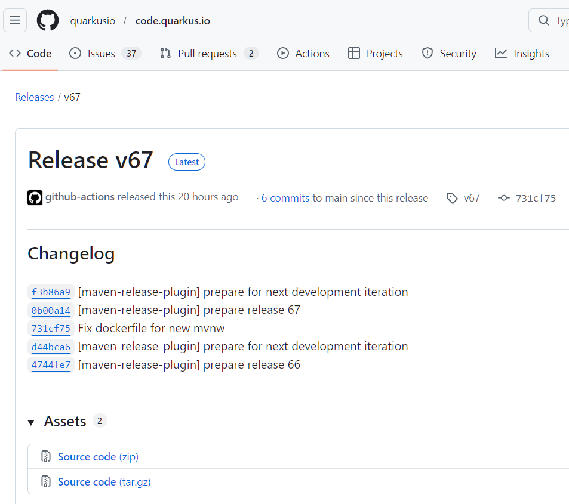
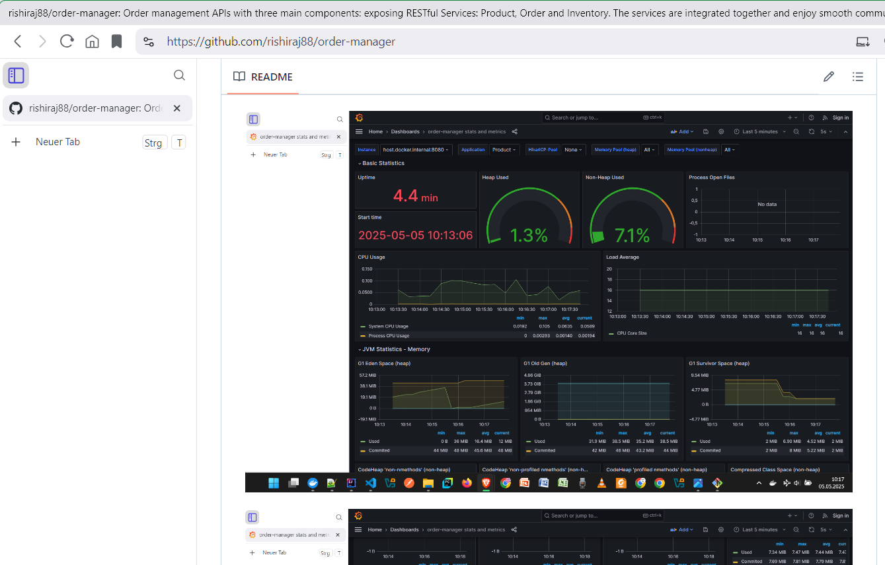
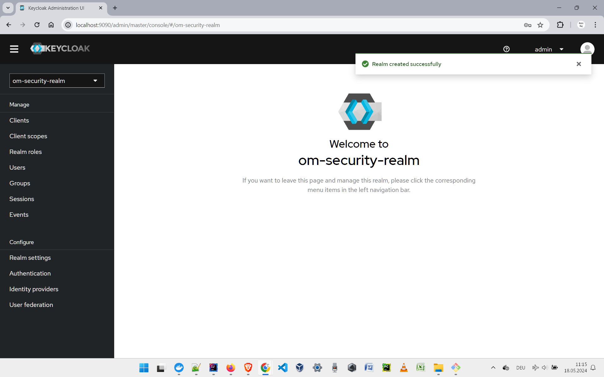

# Hi 👋, readers and imaginators!

Feel free to fork into the respositories here. The nice acts of collaboration and sharing are always welcome.  

## New Addition: Vendor and Client data with Quarkus and containers
[vendor-client-data-manager-quarkus-containers](https://github.com/rishiraj88/vendor-client-data-manager-quarkus-containers)
### Why Quarkus
Quarkus offers container-first support to the applications built for JVM (Java Virtual Machine) and JVM compatibles.

### the Need for Container-first Approach
In modern era, microservices and the applications connected over network are quite common and usually a go-to approach for system design. Hence it is utmost important for our toolset to be well acquainted with the features and abilities to develop distributed systems with microservices and APIs. And, containers make a perfect pitch for this goal.

built with:
- Quarkus: container-first GraalVM for Java,
- GraalVM: graalvm-jdk,
- PostgreSQL: RDBMS,
- Panache ORM,
- GraphQL, and
- Docker.

## New Addition: a caching solution for semantic search and hybrid search, using Milvus (a powerful vector DB offering) for RAG
[RAG-Caching-with-Vector-database](https://github.com/rishiraj88/RAG-Caching-with-Vector-database/tree/main)

built with:
- Milvus (a powerful vector DB offering),
- LangChain,
- pandas, and
- OpenAI for LLM.

## Quarkus is again hot in Industry, especially for the ease it provides with Kubernetes
Releases v67 and later of Quarkus is out now!

To prioritise realisable ideas (SMART goals) and realise the top three, I rate them with-
- feasibility study,
- absolute value proposition,
- cost in terms of effort and time, and 
- value for money (the returns against risk & investment). RoRI = RoR + RoI

For example, you may have a kind look at the dashboard (built for a project) here:

## 💬 My Best among Key Skills: 
### Driving Factors: Innovations, Partnerships, Initiatives 
- Product Architectures: Event-sourced and async APIs, ReSTful APIs, gRPC for streaming, Microservice Architecture, Messaging
- Development & Design: REST Principles, Domain-Driven Design (DDD) & Hexagonal, TDD, Continuous Delivery, DevOps, SOLID, YAGNI, Requirements Engineering (FR+NFR), Scaled Agile, Documentation, JIRA, Testing Automation (Unit + Integration), E2E Testing, UAT
- Languages: Kotlin, Java 25, Multithreading, Kotlin, JavaScript, Bash
- Frameworks, Libraries & Environments: Spring Boot, Quarkus, JAX-RS, Ktor, Jakarta EE, Node.js, Express.js, TypeScript, Hibernate, Spring Security, Spring Cloud, React.js, Angular, Thymeleaf
- Utilities: Kafka, RabbitMQ, JUnit, Playwright, UML, Mockito, Webpack, Babel, Jest, Git, BitBucket (Atlassian), Sentry, Cursor, Claude, IntelliJ IDEA, VS Code, eclipse
- Data Stores: RDBMS (MySQL, PostgreSQL, Oracle, PL/SQL, SQL Scripts), NoSQL (MongoDB, Neo4j, Redis)
- Cloud Platforms: AWS (EC2, S3, RDS, Glue, Kinesis, Athena, Redshift, Lambda, Step Functions, EKS, Fargate, CloudFormation), Azure(VM, Database, Data Factory, DevOps), GCP (Google Storage, Cloud Run, App Engine), Linux, Bash Scripting, Containerization & Orchestration, Podman, Docker, Kubernetes
- CI/CD: Azure DevOps, AWS DevOps, Iac (Terraform, Pulumi), GitHub Actions, Jenkins Pipelines, Gitlab CI, ArgoCD GitOps
- Worflow Automation: Airflow, n8n
- STEM: Computer Science (Data Structures, Algorithms, Automation), Applied Science, Mathematics, Statistics

### Modern Tech Tools: 
- Semantic Search: RAG, LangChain, LangGraph, LangChain4j, Vector Embeddings
- Data Analytics & GenAI: ML (Machine Learning) with Python, AI (Artificial Intelligence), LLaMA (Large Language Models), GenAI products (Gemini)
- PoC’s to Implement: Time Schedule Planner, Fleet Management, Multi-Currency Apps, Logistics for e-Commerce, Core Banking, Stocks (Bonds, Derivatives, Dividends), Biochemistry, Patient Care, Pharma (Apotheke)

_Let’s create efficient systems and bridge gaps. Experiences will build a life-long experience._
_Challenges are stepping stones. One must step upon them and progress._
😄

## Some of the Projects and Collections I have Prepared by Now
Code samples and PoC's
... for learners and seekers to refer quickly.

## A. My Favorite Projects
I must not mix them among the others by enumerating. So, here are many, many repositories, gists and projects. ROLLING DRUMS!!!

### 1. Terraform with AWS [a PoC to mentor a beginner on Terraform](https://github.com/rishiraj88/terraform-poc)
A new team member as well as an entrant into IaC arena can easily learn and quickly start delivering value with this repository. Its self-explanatory code is enough to couple with Terraform Cloud. Declaring resources with the help of variables is detailed out very well.

### 2. Chatbot for use with Banking, Insurance or even e-Commerce Marketplace [e-Commerce Chatbot, powered with LangGraph, LangChain and ReAct framework](https://github.com/rishiraj88/ecommerce-chatbot-langgraph)
LangGraph-powered Chatbot for e-Commerce platform, with Conversational AI and memory.

### 3. A personalized Chatbot [Chatbot-Langchain PoC](https://github.com/rishiraj88/chatbot-langchain)
a personalized Chatbot, built with with the following:
- LangChain
- fitz
- OpenAI API
- BeautifulSoup
- Flask
- 
### 4. RAG: Retrieval-augmented Generation [LLM-powered apps (built using LangChain)](https://github.com/rishiraj88/langchain-langserve-vectorembeddings)
Here are featured multiple apps, powered with various libraries and projects under LangChain umbrella, thanks to the comprehensive documentation:
- [LangChain Expression Language] (https://www.langchain.com/blog/langchain-expression-language)
- [output_parsers | langchain_core | LangChain Reference] (https://reference.langchain.com/python/langchain-core/output_parsers)
- [Faiss for similarity search] (https://ai.meta.com/tools/faiss/)
- [Retriever integrations - Docs by LangChain](https://docs.langchain.com/oss/python/integrations/retrievers)
- [Build a RAG agent with LangChain - Docs by LangChain](https://docs.langchain.com/oss/python/langchain/rag)
- [passthrough | langchain_core | LangChain Reference](https://reference.langchain.com/python/langchain-core/runnables/passthrough)

### 5. Football World Cup Scoreboard [Scoreboard Easy to Customize for Other Game Genres](https://github.com/rishiraj88/footballWorldCupLiveScoreboard)
It is a data feed library for Live Score Board of Football World Cup. Right now it shows all ongoing football matches from our data feed providers and the live scores updated accordingly.

### 6. Net Price Calculator [Net Price Across Currencies](https://github.com/rishiraj88/netcalculator)
A comprehensive service for a multinational (or even global) company which operates in any financial domain. It is a service which allows consumers to calculate the net price of a product or service based on its gross price and the prevalent VAT (MWSt) rate. Our calculator also takes into consideration forex rates and performs the foreign currency conversions (foreign exchanges).

### 7. Leasing: Vehicle Leasing and Returning [Leasing](https://github.com/rishiraj88/leasing)
End-User Utility to take vehicles on lease, respect such leasing contracts and returning the leased vehicles to the providers. For use by customers (vehicle users). Screenshots of the revamped UI to attach in next update.

### 8. Order Management [OM](https://github.com/rishiraj88/order-manager)
It has three main modules - Product, Order, Inventory - exposing their services with Web Services via synchronous and asynchronous communications.
It has been implemented using these tech and tools (and more);
- Spring Boot 3.2, with Spring Web
- Spring Cloud Config (for service integration)
- Spring Security (for Authz-n-Authn)
- Keycloak (for user account management)
- MongoDB (NoSQL Database)
- Spring Data MongoDB (for Mongo Repository)
- MySQL (Relational Database System)
- Spring Data MySQL (for JPA Repository)
- Flyway (for Database Migration)
- Docker-Compose (for containerization)
- Swagger (for OpenAPI-based API documentation)
- Testcontainers (for Test Automation with stubs)
- Rest-Assured (for Testing and Validation)
- Lombok (for boilerplate code injection)
- Spring RestClient (out of Spring Boot)

### 9. Photo Search Tool implemented with React and TypeScript [Photo Basket](https://github.com/rishiraj88/photobasket)
- Photo Search implemented with the following:
-- Web UI with React/TypeScript
-- [WIP] backend APIs with NodeJS, Spring Boot and FastAPI
- Photo Basket (an online photo library)
-- Photo Search Tool implemented with RESTful APIs in Backend, React in Frontend; with TypeScript in full stack.
-- Development status: active
-- To secure the API access token (and more secrets) next
- Revamp: Second phase of development
-- Proofing the need and the feasibility of RAG- and GenAI-powered features, such as chatbot and semantic search.
  
### 10. Employee On-Boarding [New-Age HRMS](https://github.com/rishiraj88/EmployeeOnboardingStateMachine)
The compact Human Resource management tool for adding talent to build Superteams!!! A must-have accelerator for modern large-scale enterprises. It allows for rapid onboarding of people and reduces error rates.

### 11. Python: Jupyter Notebooks (.ipynb) [Link](https://github.com/rishiraj88/PythonSnippets/tree/main/JupyterNotebooks)
- calendar
- cube root
- random module usage

### 12. Python Scripts and Programs (without Notebooks) [Link](https://github.com/rishiraj88/PythonSnippets/tree/main/Python101)
- addTwoNums.py
- areaOfTriangleByBaseAndHeight.py
- armstrongNumber.py
- armstrongNumbersInRange.py
- checkEvenOddNumber.py
- checkLeapYear.py
- checkPositiveNegativeZero.py
- checkPrimeNumber.py
- convertKmToMile.py
- convertMileToKm.py
- desktop.ini
- factorial.py
- fibonacciSeries.py
- generateRandomNumber.py
- largestNumberQuiz.py
- largestOfThreeNumbers.py
- main.py
- multiplicationTable.py
- o2c_otc.pdf
- passwordGenerator.py
- powersOfTwo.py
- printHelloWorld.py
- printPrimeNumberInSomeRange.py
- readPdfFileOut.py
- squareRoot.py
- swapTwoNumbers.py
- temperatureCelToFahr.py

### 13. LeetCode Problems Solved [Link](https://github.com/rishiraj88/LeetCode/tree/main/LeetCodeSolutions/src)
- **LC01TwoSum.java :** Given an array of integers nums and an integer target, return indices of the two numbers such that they add up to target.
- **LC02AddTwoNumbers.java :** Given two non-empty linked lists representing twonon-negative integers. The digits are stored in reverse order, and each of their nodes contains a single digit. Add the two numbers and return the sum as a linked list.
- **LcMaxConsecutiveOnes.java :** to find the length of the longest subsequence having only 1's else to return 0
- **LcSeptemberLeetcodingChallenge2021Week4.java :** [WIP] to get the maximum length of possible words made with the segments provided in input arrays,  with the condition that no letters in the words must be repeated anyhow
And more on the way!

### 14. Various Popular Algorithms Implemented in Java and PoC's for explaining the Features of Java Core API's [Link](https://github.com/rishiraj88/JavaCoreSnippets/tree/main/JavaCore/src/main/java)
- The list of Concurrent Collections and more components available as part of Concurrency API in Java 8 and later, such as Executor, ExecutorService, Lock and Symaphore.
- **DefaultEleValue.java :** to test default values of elements of array
- **MedianOfTwoArrays.java :** to find the median for the elements of two arrays taken together
- **SecondLargest.java :** to find second largest element in an array of integers
- **FindDuplicatesInArrayByMap.java :** to  find duplicate elements in an array
- **FindDuplicatesInArrayByStream.java :** to find duplicate elements in an array
- **StreamCollectMethods.java :** to demonstrate various use scenarios of Stream.collect() method with Collectors
And more to come up!

### 15. [GIST] HTTP response status codes [Link](https://github.com/rishiraj88/rishiraj88/blob/main/HTTP%20response%20status%20codes.md)
- Status Codes for frequently used HTTP responses. Very useful and crisp list of the response codes for web development. 

### 16. [GIST] Java 8 DateTime code samples [Link](https://github.com/rishiraj88/JavaCoreSnippets/blob/main/gists/Java%208%20DateTime%20code%20samples.md)
- Code fragments for learners to refer and use quickly frequently used methods out of new Java DateTime API in Java 8+.

### 17. [GIST] Java Stream Collector/Collectors methods to Collect Streaming Data [Link](https://github.com/rishiraj88/JavaCoreSnippets/blob/main/gists/Java%20Stream%20collector-s%20methods.md)
- Code fragments for learners to learn and use efficiently all of the end-user-level methods of Java Stream API in Java 8+.

### 18. [GIST] Functional Interfaces in Java API [Link](https://github.com/rishiraj88/JavaCoreSnippets/blob/main/gists/Java%208%20Functional%20Interfaces%20in%20Java%20API.md)
- It lists various in-built interfaces and their respective methods for functional programming using Java 8+.

### 19. [GIST] Java Concurrency API, Concurrent Collections and Synchronizers in Java [Link](https://github.com/rishiraj88/JavaCoreSnippets/blob/main/gists/Java%20Concurrency%20API.md)
- The list of Concurrent Collections and more components available as part of Concurrency API in Java 8 and later, such as Executor, ExecutorService, Lock and Symaphore.### 11. What's available in Java 24 API [Link](https://github.com/rishiraj88/JavaCoreSnippets/tree/main/Java24)
- improvement in performance and memory management
    - Generational Shenandoah (garbage collector) 
- security and cryptography
    - key derivation function API 
    - quantum-resistant DSA  and more 
- modernized Java APIs 
    - ahead-of-time class loading and linking 
    - class file API 
    - more flexible pipelines with stream gatherers 
- JVM changes
    - compact object headers 
    - restricted use of JNI 
    - Security Manager is now disabled. 
- languages and syntax
    - switch, instanceof and primitive types 
    - ScopedValue to share immutable data between caller thread and child threads 
    - flexible constructor bodies (with prologue and epilogue) 
    - module import 
    - linking runtime image without JMOD 
- more structured concurrency and threading
- deprecation and "end-of-life"
    - 32-bit x86 port deprecated 
    - removal of support for Windows (32-bit x86) 

### 20. What's available in Java 21 API [Link](https://github.com/rishiraj88/JavaCoreSnippets/tree/main/Java21API)
New features available in Java 21 which we missed in Java 17 and earlier versions. Features, which are most notable and stand as the best candidates for frequent use, are listed below:
- Virtual threads (from Java 19)

- Usage of `record` types in conditionals. Very useful with `if(reference instance Type)` tests.
<pre>if(publicParameter instanceof SpecificType) {}</pre>
- labels for `switch` cases. These are very similar to `instanceof` checks.
<pre>
case TierOne test -> future = test.callActionOne();
case TierTwo test -> future = test.callActionTwo();
</pre>
- String literals (a preview feature) to build parameterized text strings. These are similar to string literals / template strings of modern JavaScript and f-strings of python. The template processor `STR` is automatically imported and is available to use without any explicit import or declaration. More template processors include `RAW` and `FMT`. Remember `"fmt"` of Go (Golang)?
<pre>String vmUserName = localSystem.retrieveUserName();
String helloVitrualWorld = STR."Hola \{vmUserName}";</pre>
- One major pathchanger about Java Collection Framework is: the introduction of "sequenced collections": `SequencedCollection`, `SequencedSet` and `SequencedMap`.
<pre>
public interface SequencedCollection<E> extends Collection<E> // since 21
public interface SequencedMap<K, V> extends Map<K, V> // since 21
public interface SequencedSet<E> extends SequencedCollection<E>, Set<E> // since 21
</pre>
- My favorite as it is about security and encryption: Key Encapsulation Mechanism (KEP) to secure symmetric keys.
- TODO: Add updated screenshots
- Implementation examples are in the project code under `Java21API` along with the checklist of which of the features have been tested.

### 21. Java 17 Examples [Link](https://github.com/rishiraj88/JavaCoreSnippets/tree/main/Java17API)
- restore always-Strict floating-point semantics
- enhanced pseudo-random number generators
- new macOS rendering pipeline
- macOS/AArch64 port
- deprecate the Applet API for removal
- strongly encapsulate JDK internals
- pattern matching for switch (preview)
- remove RMI activation
- sealed classes
- remove the experimental AOT and JIT compilers
- deprecate the Security Manager for removal
- Foreign Function and Memory API (incubator)
- Vector API (second incubator)
- context-specific deserialization filters

### 22. Java 14 Examples [Link](https://github.com/rishiraj88/JavaCoreSnippets/tree/main/Java14API/src/main/java/java14)
JDK 14 features used in various implementations:
- **InstanceofPatternMatching.java :** to declare reference for matching object upon checking its type
- **NullPointerExceptionPlus.java :** to get a more descriptive NPE description
- **RecordVsClass.java :** to demonstrate and use Record type
- **SwitchExpressions.java :** to use switch expressions instead of switch statements
- **TextBlockVsString.java :** to demonstrate a text block literal 

### 23. Java 11 Examples [Link](https://github.com/rishiraj88/JavaCoreSnippets/tree/main/Java11API/src/main/java/java11)
JDK 11 features used in various implementations:
- **CollectionPlus.java :** to get arrays out of lists
- **FilesReadStringWriteString.java :** to read from and write to file
- **HttpClientPlus.java :** to demonstrate HttpClient for GET, POST and PUT request/response handling as in JDK 11
- **JavaRunClass.java :** to run the Java program with `java JavaRunClass.java` command form
- **LambdaLocalVars.java :** to demonstrate var for lambda functions
- **OptionalIsEmpty.java :** to demonstrate Optional.isEmpty() 
- **StringApiPlus.java :** to demonstrate the new methods of String API in Java 11

### 24. RRShopware [Link](https://github.com/rishiraj88/RRShopware)
- an interactive page/view of shopping site implementation with vanilla JavaScript, CSS and HTML
- To visit the cloud-hosted site, smile and step in to [RRShops](https://rrshops.netlify.app/)

## 🌱 I’m fostering myself with more of: "all things containers" and orchestration, such as
- Docker networking across OSI Model layers of networks,
- hosting the containers in cloud infrastructure as well as in virtual networks,
- orchestrating clusters using Kubernetes, local registries and IaC tools, and
- Apache NiFi for data flow and application testing.

## 🤔 I have always been curious about Green Development by enhancing system performance. To me, the easiest approach to achieve Sustainability is:
- to write highly performant applications, services and platforms.
- In case I fall short of the SME level of expertise regarding some tools, I rely on the promises of the respective providers. They include the leading cloud service providers.

## Notes
- These repositories present the resources being developed continuously as well as ready projects. Hence keep on pulling and sync'ing regularly.
- And, yes, continuous development and continuous integration are obviously good.

## 📫 Feel free to Reach Me for Feedback, Queries, Collaboration and More:
- **LinkedIn Messaging:** <https://www.linkedin.com/in/rishirajopenminds>
- **X Byte:** <https://twitter.com/RishiRajDevOps>
- **DockerHub:** <[i50729 @ DockerHub](https://hub.docker.com/repositories/i50729))>
- **Start Page:** <https://bio.link/rishiraj49de>
- **GitHub:** <https://github.com/rishiraj88>

## Credits and Gratitude
I thank all who have mentored, taught and guided me. Also, I appreciate who have supported my work with pair programming, extreme programming and more.
